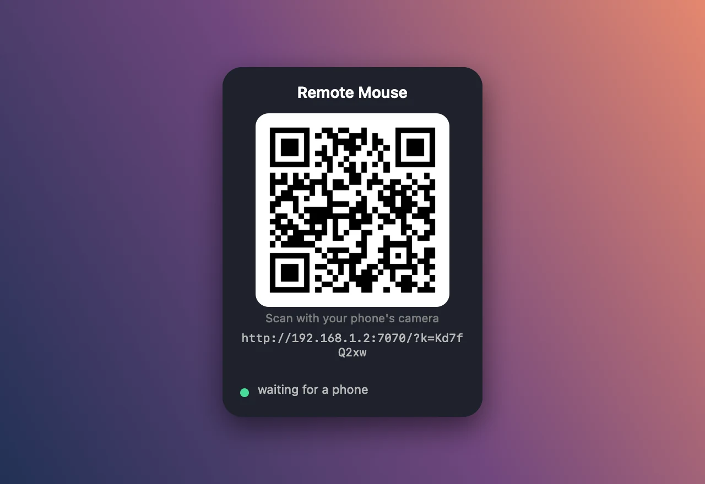
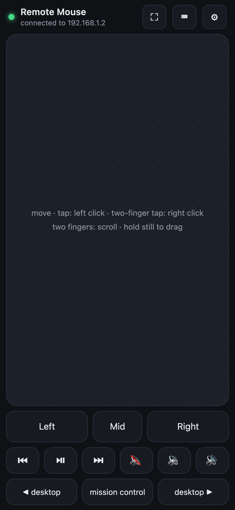
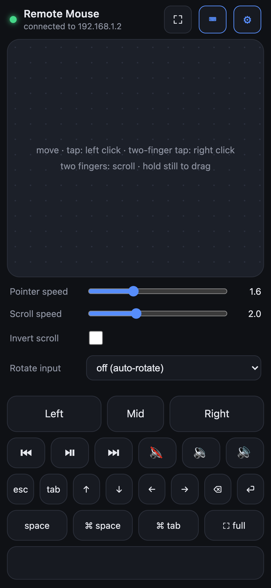

# Remote Mouse

Use your phone as a wireless trackpad and keyboard for your Mac. Move the cursor, click, scroll, drag, type,
and control volume and playback from the couch. Nothing to install on the phone: the Mac runs a small menu bar
app that serves a touchpad web page, and the phone opens it in its browser by scanning a QR code.

<p align="center"></p>
<p align="center">
  
  &nbsp;&nbsp;
  
</p>

## Requirements

- **Mac**: macOS 13 Ventura or newer, Apple Silicon or Intel.
- **Xcode Command Line Tools** to build the app (there is no prebuilt download yet). One-time install:
  ```sh
  xcode-select --install
  ```
- **Phone**: any phone with a browser (iPhone or Android), on the **same Wi-Fi network** as the Mac.

Python is **not** required. The app is a self-contained Swift binary with the web page bundled inside.

## Install

```sh
git clone https://github.com/YashGovindani/remote-mouse.git
cd remote-mouse
app/build.sh --install
open -a "Remote Mouse"
```

`build.sh --install` compiles a universal binary, signs it, and copies `Remote Mouse.app` to `~/Applications`.
Takes about a minute the first time.

## First run (one-time prompts)

The app lives in the **menu bar** only (a cursor icon near the clock). It has no Dock icon and no main window.

1. **Accessibility.** macOS asks "Remote Mouse would like to control this computer using accessibility features".
   Click *Open System Settings* and turn on **Remote Mouse** under *Privacy & Security > Accessibility*.
   Without this, macOS silently drops every mouse and key event. The menu shows a ⚠︎ item until it's granted;
   the status turns green within a few seconds of enabling it (quit and reopen the app if it doesn't).
2. **Firewall.** If the macOS firewall is on, the first phone connection triggers "Do you want Remote Mouse to accept
   incoming network connections?" Click *Allow*.
3. **Login item.** The app registers itself to start at login and macOS shows a notification saying so.
   Turn it off any time via *Start at Login* in the menu, or under *System Settings > General > Login Items & Extensions*.
4. **Desktop widget.** A QR card appears on the desktop (above the wallpaper, below your windows). Drag it wherever
   you like; the spot is remembered. It hides while a phone is connected and comes back when none is.
   Toggle it with *Show QR Widget* in the menu.

## Connect the phone

1. Make sure the phone is on the same Wi-Fi as the Mac (not mobile data, not a guest network, VPN off).
2. Point the phone's **camera** at the QR code, on the desktop widget or in the menu bar dropdown, and open the link.
   Or use *Copy Phone Link* from the menu and send it to the phone.
3. The page opens in the browser. The dot in the header is **green** when connected, **red** while it retries.
4. Recommended: **Add to Home Screen** (Safari: Share > Add to Home Screen; Chrome: menu > Add to Home screen /
   Install app). It then opens as its own app with a proper icon and **no browser URL bar**, and it remembers the
   link, so it keeps working across restarts.

The page keeps the phone's screen awake while it is open. Browsers only offer the real wake-lock API on HTTPS, so
over plain HTTP the page plays a tiny silent video after your first touch instead. One side effect on iPhone: starting
it pauses any music the phone itself is playing.

The link contains a secret token. Anyone on your network who has it can control the Mac, so don't share it.
*New Link* in the menu makes a fresh one and invalidates the old.

## Using it

| Gesture on the pad | Action |
|---|---|
| one finger drag | move the cursor (mild acceleration) |
| tap / double tap | left click / double click |
| two-finger tap | right click |
| two-finger drag | scroll |
| hold still ~0.5 s, then drag | drag (pad outline turns blue) |
| three-finger swipe left / right | next / previous desktop (same as the buttons; content follows the fingers) |
| three-finger swipe up / down | Mission Control / App Exposé (all windows of the current app) |
| Left / Mid / Right buttons | hold to drag; tap twice quickly for a double click |

- **⛶ Fullscreen trackpad**: the whole screen becomes the pad, and where the browser allows it (Android Chrome, iPad)
  the browser's own bars disappear too. iPhone Safari refuses page fullscreen, so there the page tells you to use
  Add to Home Screen instead, which opens without any browser bars. Tap the small pill in the top-right corner to exit.
- **⌨︎ Keyboard**: a text box (every character you type is sent live, backspace works), plus esc, tab, arrows,
  enter, backspace, space, ⌘ space (Spotlight), ⌘ tab (switch apps) and ⌃⌘ F (fullscreen).
- **Media row**: previous, play/pause, next, mute, volume down, volume up.
- **Desktops row**: ◀ desktop, mission control, desktop ▶. These send the standard Ctrl+←, Ctrl+↑ and Ctrl+→
  shortcuts, which are on by default under *System Settings > Keyboard > Keyboard Shortcuts > Mission Control*.
- **⚙︎ Settings**: pointer speed, scroll speed, invert scroll, rotate input. Saved on the phone.
- **Landscape**: turn the phone and the controls move to a column on the right, the pad takes the rest.
  If the phone has rotation lock on, set *Rotate input* to the side you turned it so finger motion still maps correctly.

Several phones can be connected at once.

## Menu bar reference

| Item | What it does |
|---|---|
| QR card | the link as a QR code, plus status: waiting / N phones connected / needs Accessibility |
| Copy Phone Link | copies `http://<mac-ip>:7070/?k=<token>` |
| Open in Browser | opens the page on the Mac itself (handy to check the server) |
| New Link | new token; old links stop working |
| Show QR Widget | toggle the widget |
| Start at Login | toggle the login item |
| Grant Accessibility Access | only shown while permission is missing; opens the settings pane |
| Restart Server | restarts the built-in server |
| Quit Remote Mouse | stops everything |

## Changing the port or token

Settings are stored in the `com.yashg.remote-mouse` defaults domain. After changing them, quit and reopen the app.

```sh
defaults write com.yashg.remote-mouse port -int 8080      # default 7070
defaults write com.yashg.remote-mouse token "mySecret"    # default: random, generated once
defaults delete com.yashg.remote-mouse                    # reset everything (new token, widget on, first-run again)
```

## Troubleshooting

- **The cursor doesn't move but the phone says connected.** Accessibility isn't granted, or it was granted to an
  older build. Open *Privacy & Security > Accessibility*, remove any stale "Remote Mouse" entry with the − button,
  enable the current one, then quit and reopen the app.
- **The phone can't load the page.** Both devices must be on the same Wi-Fi. Guest networks and some routers isolate
  devices from each other (look for "AP isolation" or "client isolation" in the router settings). Turn off any VPN on
  the phone. If the Mac firewall is on, allow Remote Mouse. Check *Open in Browser* on the Mac works first.
- **The QR says `<no-wifi>`.** The Mac has no IPv4 address on Wi-Fi or Ethernet. Reconnect to the network.
- **The link stopped working after a while.** The Mac's IP changed (DHCP). Rescan the QR, and consider giving the
  Mac a fixed IP in the router. The token part never changes.
- **"bad token"** in the browser: the link is stale after *New Link*. Rescan.
- **Scroll goes the wrong way.** Toggle *Invert scroll* in ⚙︎ on the phone.
- **Pointer too slow or fast.** Adjust *Pointer speed* in ⚙︎.
- **Port already in use.** Something else uses 7070. Change the port as shown above.
- **The widget is gone.** It hides while a phone is connected. Check the menu toggle if it stays hidden.

## Updating or rebuilding

```sh
cd remote-mouse && git pull
app/build.sh --install && open -a "Remote Mouse"
```

By default the app is ad-hoc signed, so **each rebuild changes its identity and macOS forgets the Accessibility
grant**. After rebuilding, open *Privacy & Security > Accessibility*, remove the old "Remote Mouse" entry (−) and
enable the new one. If you rebuild often, set up a local certificate once (next section) and this stops happening.

### Local development: a stable signing identity

Create a self-signed code-signing certificate named **Remote Mouse Dev** in your login keychain. `build.sh` uses it
automatically whenever it exists (or set `RM_SIGN="<name>"` to use any other identity). macOS will ask for your
password once to trust the certificate, and codesign may ask for keychain access the first time (choose *Always Allow*).

```sh
openssl req -x509 -newkey rsa:2048 -sha256 -days 3650 -nodes -keyout dev.key -out dev.crt \
  -subj "/CN=Remote Mouse Dev" -addext "keyUsage=critical,digitalSignature" \
  -addext "extendedKeyUsage=critical,codeSigning" -addext "basicConstraints=critical,CA:false"
openssl pkcs12 -export -legacy -inkey dev.key -in dev.crt -out dev.p12 -passout pass:x -name "Remote Mouse Dev"
security import dev.p12 -k ~/Library/Keychains/login.keychain-db -P x -T /usr/bin/codesign
security add-trusted-cert -r trustRoot -p codeSign -k ~/Library/Keychains/login.keychain-db dev.crt
rm dev.key dev.p12 dev.crt
app/build.sh --install && open -a "Remote Mouse"      # re-grant Accessibility one last time
```

(`-legacy` matters: macOS can't import the PKCS#12 format that OpenSSL 3 writes by default.)
This only removes the re-grant hassle on your own Mac; it is not a Developer ID, so copies of the app downloaded
on other Macs still get the Gatekeeper warning.

## Uninstall

1. Quit Remote Mouse from the menu.
2. `rm -rf ~/Applications/"Remote Mouse.app"`
3. `defaults delete com.yashg.remote-mouse`
4. Remove it from *System Settings > General > Login Items & Extensions* and from *Privacy & Security > Accessibility*.

## Python version (optional, for tinkering)

The original server, `server.py`, does the same job from a terminal and is handy for hacking on the protocol.
It needs Python 3.10+ and [uv](https://docs.astral.sh/uv/):

```sh
uv venv .venv
uv pip install --python .venv/bin/python pyobjc-framework-Quartz pyobjc-framework-ApplicationServices websockets qrcode
./run.sh                      # options: --port 7070  --token SECRET  --no-token
```

It prints the link and a QR code in the terminal. Accessibility must be granted to the **terminal app** you run it from,
and the token is random on every start unless you pass `--token`. Quit the menu bar app first, or use a different port.

## Project layout

- `app/Sources/*.swift`: the menu bar app. `Server.swift` (HTTP + WebSocket on Network.framework), `Injector.swift`
  (CGEvent injection), `Widget.swift` (QR card + desktop panel), `AppDelegate.swift` (menu, login item, IP polling).
- `app/build.sh`, `app/Info.plist`, `app/AppIcon.icns`, `app/make_icon.py`: build script, bundle metadata, icon.
- `index.html`, `manifest.json`, `icons/`: the touchpad page, its web app manifest and home-screen icons, bundled into
  the app at build time. Edit and rebuild to change the phone UI.
- `server.py`, `run.sh`: the Python server.
- `docs/`: README images.

## Protocol

JSON text messages over a WebSocket at `ws://<mac-ip>:7070/ws?k=<token>`:

`{"t":"move","dx":..,"dy":..}` · `{"t":"click","b":"left|right|middle","n":1|2}` · `{"t":"down"/"up","b":..,"n":..}` ·
`{"t":"scroll","dx":..,"dy":..,"mods":["ctrl"]}` · `{"t":"text","s":"hello"}` · `{"t":"key","code":"enter","mods":["cmd"]}` ·
`{"t":"media","name":"play|next|prev|volup|voldown|mute"}` · `{"t":"ping"}` → `{"t":"pong"}`

## License

MIT, see `LICENSE`.
